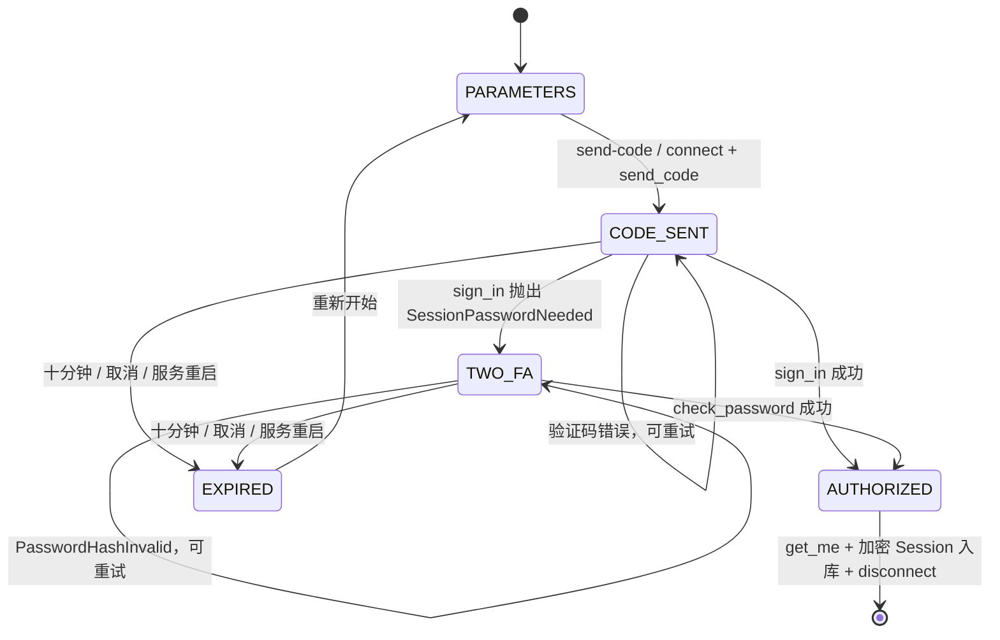

# tg-signer Dashboard

面向 Telegram 签到、自动化与消息监控的单容器 Web 控制台（当前版本：`1.1.0`）。

源码仓库：<https://github.com/hbsx/TG-SIGNER> · 原项目：<https://github.com/dongbo501/TG-SIGNER> · 上游执行器：<https://github.com/amchii/tg-signer>

基于 [amchii/tg-signer](https://github.com/amchii/tg-signer) 的中文 Web 控制台。前后端、Telegram 协议库和 tg-signer **打包在一个 Docker 镜像、一个运行容器中**。无需另外部署 Node、Nginx、Redis 或数据库容器。

前端采用 Next.js 14 App Router 静态导出、React、Tailwind CSS、Shadcn 风格的 Radix UI 组件、TanStack Table、Lucide、Zustand 和 Recharts；FastAPI 同时提供静态网页、REST API 与 WebSocket；前端支持 EventSource 自动回退。后端采用 SQLAlchemy + SQLite WAL、APScheduler、Kurigram（兼容 Pyrogram）。

上游代码固定于 `fc8905db2ee74e2d9afc135cce88b50be35b6212`，版本 `0.9.1`，保留完整源码和 BSD-3-Clause 许可证。功能依据上游 README、配置模型、签到/监控执行器、automation 引擎及使用文档实现。未修改上游源码。

## 1. 项目目录

```text
.
├── Dockerfile                    # 多阶段构建，最终只有一个 Python 运行容器
├── docker-compose.yml            # 唯一服务 dashboard，包含全部安装参数
├── scripts/
│   ├── deploy.sh                 # 创建数据目录并一键构建、部署
│   ├── backup.sh                 # 停机一致性备份，自动恢复运行
│   └── package.sh                # 导出已构建镜像和 VPS 一键部署包
├── backend/
│   ├── requirements.txt
│   ├── app/
│   │   ├── main.py               # REST API、Cookie 鉴权、WS、静态页面
│   │   ├── auth.py               # Telegram 多步骤登录状态机
│   │   ├── security.py           # Argon2、JWT、Fernet 加密、限流
│   │   ├── schemas.py            # Pydantic 请求与上游配置校验
│   │   ├── db.py                 # SQLAlchemy 模型和 SQLite
│   │   ├── telegram.py           # 共享客户端、无交互登录、上游适配
│   │   ├── engine.py             # 随机调度、任务执行、规则审计
│   │   ├── events.py             # 日志桥接、有界 WebSocket 队列
│   │   └── notifications.py      # 五种通知渠道
│   └── tests/                    # API、鉴权、登录状态机、调度与匹配测试
├── frontend/
│   ├── app/{layout.tsx,page.tsx,globals.css}
│   ├── components/
│   │   ├── auth-dialog.tsx        # useReducer 登录状态机
│   │   ├── task-editor.tsx        # 动作表单、完整 JSON、YAML 导入
│   │   ├── schedule-picker.tsx    # 鼠标/键盘选择时间与重复频率
│   │   ├── logs.tsx              # WS 终端与分页执行历史
│   │   ├── settings.tsx
│   │   ├── tools.tsx
│   │   ├── common.tsx            # TanStack Table 等通用组件
│   │   └── ui/                   # Radix / Shadcn UI 基础组件
│   ├── lib/{api.ts,store.ts,utils.ts,schedule.ts}
│   ├── tests/dashboard.spec.ts    # Playwright 浏览器回归
│   └── package-lock.json
├── upstream/tg-signer/            # 固定版本的完整上游
├── docs/
│   ├── ARCHITECTURE.md
│   ├── FEATURES.md                # 上游能力到网页入口的逐项映射
│   └── VERIFICATION.md
└── data/                         # 唯一持久数据目录，不进入镜像/版本控制
    ├── dashboard.sqlite3
    ├── encryption.key
    ├── jwt.key
    ├── initial-password.txt      # 首次随机密码，修改后删除
    └── upstream/                 # 上游记录、规则状态、自定义插件
```

## 2. Telegram 登录状态机与完整代码

后端完整实现：[backend/app/auth.py](backend/app/auth.py)。前端完整实现：[frontend/components/auth-dialog.tsx](frontend/components/auth-dialog.tsx)。路由：[backend/app/main.py](backend/app/main.py)。



- `POST /api/auth/send-code`：手机号、自定义或默认 API、独立代理；返回随机 `flow_id`、`phone_code_hash`、重发倒计时。
- `POST /api/auth/sign-in`：验证 flow、hash、验证码；返回 `AUTHORIZED` 或 `2FA_REQUIRED`。
- `POST /api/auth/check-2fa`：仅允许在 `2FA_REQUIRED` 状态提交密码。
- `DELETE /api/auth/flows/{flow_id}`：取消并清理连接。
- 每个流程单独加锁，最多八次验证尝试、十分钟有效期；每个手机号限频，最多二十个未完成流程。错误请求不会越过状态机。
- 不调用 Pyrogram 交互式 `start()` 获取验证码，不保存验证码、2FA 密码或待登录流程到数据库。成功后 Session、API_HASH、代理凭据以 Fernet 加密。
- 导入支持 **Pyrogram/Kurigram** Session String 与 `.session` SQLite 文件；先验证实际授权，再保存。Telethon 文件不是相同格式，会明确拒绝而不是错误识别。

## 3. 数据表与任务执行

完整 SQLAlchemy 模型位于 [backend/app/db.py](backend/app/db.py)。

| 表 | 关键字段 | 用途 |
|---|---|---|
| `accounts` | `user_id UNIQUE`、`session`、`api_hash`、`proxy`、状态、头像、最后验证时间 | 账号与加密凭据 |
| `tasks` | `account_id FK`、`kind`、`enabled`、`cron`、时区、随机上下限、正则、完整 `config JSON`、`next_run` | 三种任务统一管理 |
| `runs` | 账号/任务外键与名称快照、开始/完成时间、结果、摘要、Telegram 原文 | 签到及每次自动化规则的执行审计 |
| `settings` | `key PRIMARY KEY`、`value` | 密码哈希、JWT 版本、代理、AI、加密通知配置 |

删除任务会保留历史执行快照；绑定任务的账号不能直接删除。SQLite 使用 WAL、外键约束与 30 秒 busy timeout。

随机执行时间 = 标准五段 Cron 的下一次时间 + `[delay_min, delay_max]` 范围内随机秒数，采样后写入数据库。Cron 按 POSIX 语义解释（0/7 为周日）。APScheduler 执行持久时间对应的单次作业。重启后恢复时间，五分钟内的过期调度补执行一次，更久的错过任务跳到下一次；同一任务拒绝并发触发，同账号签到与工具操作串行执行。手动运行立即进入队列，不再叠加随机等待。

网页调度使用时间选择器，可点击选择或键盘输入 `08:30`，支持每天、工作日、周末、每周指定星期、每月指定日期。每月日期支持多选，例如每月 1、15、28 日均在同一时间执行；当月没有的日期会跳过，其余所选日期照常执行。任务列表显示中文计划，正常配置无需输入 Cron。导入的复杂计划会原样保留，直到明确选择新的重复频率。后端与配置导出仍使用兼容上游的 Cron 格式。

五种签到动作直接复用上游 `UserSigner` 和 Telegram API 限速/FloodWait 包装器，额外捕获普通消息、编辑消息和按钮回调提示。成功正则逐目标校验，失败规则优先；缺少成功规则时记录为 **completed（动作完成，未验证签到成功）**。不同话题和自己发出的消息不会被误计为成功回复。正则匹配设置执行时间预算。

Automation 复用上游触发器、过滤器、模板、handler、持久状态；Monitor 保留上游兼容行为。每次规则处理单独写入执行历史，监听任务可启停，服务重启会恢复启用的监听。

## 4. 单容器部署

默认端口映射为 `127.0.0.1:8999:8999`，访问 **http://127.0.0.1:8999**。全部安装参数直接在 `docker-compose.yml` 中修改，无需 `.env` 文件：

```yaml
ports:
  - "127.0.0.1:8999:8999"
environment:
  TZ: "Asia/Shanghai"
  COOKIE_SECURE: "false"
  ADMIN_PASSWORD: ""
```

首次密码：

```bash
sudo cat data/initial-password.txt
```

容器内读取也可以：

```bash
docker compose exec dashboard cat /data/initial-password.txt
```

设置页可修改密码；变更会撤销所有旧 JWT。也可以在首次初始化前修改 `docker-compose.yml` 的 `environment.ADMIN_PASSWORD`，设置至少十二位的密码；留空则自动生成。之后修改此参数不会覆盖已保存的密码。

最终镜像只包含 Python 运行时、构建好的前端、tg-signer 与依赖。容器以 UID 10001 运行、根文件系统只读、移除 Linux capabilities；`/data` 挂载可写，`/tmp` 使用 tmpfs。容器监听 8999，静态页面、API、WebSocket 使用同一来源。**请维持单 worker 和单副本**，以免重复调度和 Telegram Session 争用。

远程通过 SSH 访问：

```bash
ssh -L 8999:127.0.0.1:8999 root@服务器地址
# 然后在自己电脑打开 http://127.0.0.1:8999
```

如需直接绑定其他地址，修改 `docker-compose.yml` 的 `ports`，例如 `"0.0.0.0:8999:8999"`；修改宿主机端口时保留最后的容器端口 `8999`。面向公网使用现有 HTTPS 反向代理，并在同一文件的 `environment` 中设置 `COOKIE_SECURE: "true"`；代理应保留 Host 并支持 WebSocket。修改配置后执行 `docker compose up -d --wait` 生效。项目不会修改机器已有的代理或其他容器。

管理命令：

```bash
docker compose ps                         # 健康状态
docker compose logs --tail=100 -f          # 服务日志
docker compose restart                   # 重启
docker compose up -d --build --wait       # 更新
docker compose down                      # 删除唯一容器和项目网络，保留 data
# 删除镜像（可选）
docker image rm tg-signer-dashboard:local
```

彻底删除账号和密钥时，在确认备份不再需要后再删除 `data/`。`docker compose down -v` 不会删除这里使用的宿主机绑定目录。

备份与恢复：

```bash
./scripts/backup.sh
# 恢复：先 docker compose down，再解压备份到项目目录
# sudo tar -xzf backups/tg-signer-时间戳.tar.gz -C .
# sudo chown -R 10001:10001 data
# docker compose up -d --wait
```

必须把数据库与 `encryption.key`、`jwt.key` 一起备份。丢失加密密钥将无法解密已有会话。不要把数据目录或导出的 Session 提交到 Git。

Swagger：登录后打开 **http://127.0.0.1:8999/api/docs**；OpenAPI JSON：`/api/openapi.json`。

## 功能与验证边界

网页支持签到/自动化/Monitor、全部五种动作、多账号执行、配置导入导出、Folder 与话题、成员查询、Telegram 定时消息、记录迁移、Python handler 插件、AI 设置和五种失败通知。详细映射见 [docs/FEATURES.md](docs/FEATURES.md)。

真实 Telegram 登录/发信、AI 识别与外部通知需要您自己的有效账号、网络/API Key 和通知渠道。交付测试使用隔离的临时数据库和模拟 Telegram 返回，**未冒用真实账号、未向外部发送测试消息，未宣称线上签到已验证**。首次实际使用请先添加账号、测试连接，再手动执行一个目标任务检查回复匹配。

完整验证记录见 [docs/VERIFICATION.md](docs/VERIFICATION.md)。

## 本地开发

```bash
python3 -m venv .venv
.venv/bin/pip install -r backend/requirements.txt -e './upstream/tg-signer[yaml]'
.venv/bin/pip install pytest pytest-asyncio ruff
npm --prefix frontend ci
npm --prefix frontend run build
DATA_DIR=/tmp/tg-dashboard-dev STATIC_DIR=frontend/out \
  .venv/bin/uvicorn backend.app.main:app --host 127.0.0.1 --port 8081
```

静态导出与后端同源，修改页面后重新构建。启动会在开发数据目录生成独立初始密码。

```bash
.venv/bin/ruff check backend
.venv/bin/python -m pytest -q backend/tests
.venv/bin/python -m pytest -q upstream/tg-signer/tests
npm --prefix frontend run typecheck
cd frontend
npx playwright install chromium
npm run test:e2e
```

## 已构建镜像包与 GitHub Release

每次发布会分别在原生 amd64 和 ARM64 构建机上编译，并提供对应架构的 Docker 镜像和 VPS 完整部署包。最新版本请在本 fork 的
[Releases](https://github.com/hbsx/TG-SIGNER/releases) 页面下载；发布资产包含：

- `tg-signer-dashboard-{amd64,arm64}.tar.gz`：对应架构的 Docker 镜像。
- `tg-signer-dashboard-vps-{amd64,arm64}.tar.gz`：包含镜像、Compose、安装脚本和说明的完整部署包。
- 每个资产附带 `.sha256` 校验文件，完整部署包内部还有 `SHA256SUMS`。

完整部署包分别适用于 Linux x86_64 / amd64 和 aarch64 / arm64，包内不包含账号、任务数据或密钥。全新安装时，可下载本 fork 的架构识别脚本：

```bash
curl -fL https://raw.githubusercontent.com/hbsx/TG-SIGNER/main/scripts/install-release.sh -o install-release.sh
sudo bash install-release.sh
```

脚本从本 fork 的最新 Release 下载相应架构的部署包并校验 SHA256；已有安装目录时会停止，避免覆盖现有数据和自定义配置。手动下载完整部署包后，按实际架构替换下例的 `amd64`：

```bash
mkdir -p /opt/tg-signer
tar -xzf tg-signer-dashboard-vps-amd64.tar.gz \
  -C /opt/tg-signer --strip-components=1
cd /opt/tg-signer
sha256sum -c SHA256SUMS
bash install.sh
```

安装参数直接修改 `docker-compose.yml`。默认只绑定 `127.0.0.1:8999`；首次随机密码写入
`data/initial-password.txt`。远程使用 SSH 隧道或 HTTPS 反向代理，详细说明见
[release/INSTALL.txt](release/INSTALL.txt)。

从源码重新构建镜像和部署包：

```bash
# 先完成本地测试，再构建
./scripts/deploy.sh
bash scripts/package.sh
```

`release/tg-signer-dashboard-{amd64,arm64}.tar.gz` 和完整 VPS 压缩包是生成物，已被 Git 忽略；脚本会在
本地生成，推送 `v*` 标签后由 GitHub Actions 上传到本 fork 的 Release。发布包使用当前 `docker-compose.yml`，不会打包 `data/`、
`.env`、Telegram Session 或日志。
